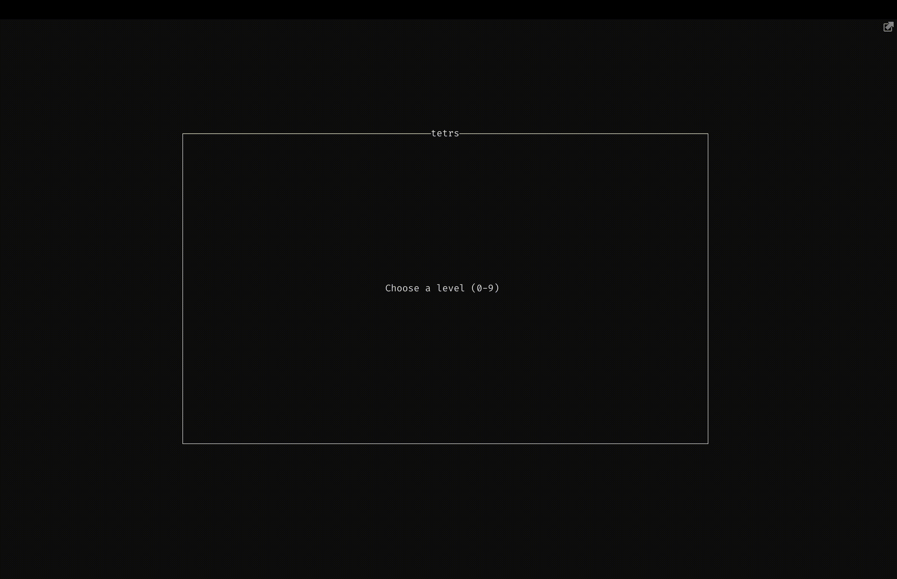

# tetrs

Yes, I rewrote it in Rust. Yet another command line tetris. Inspired by samtay's [Haskell version](https://github.com/samtay/tetris).



## Install

### Cargo

<https://crates.io/crates/tetrs/>

```shell
cargo install tetrs
```

### macOS

```shell
brew tap freymo/tetrs
brew install tetrs
```

## Download Binary

Go to [Releases](https://github.com/FreyMo/tetrs/releases)

## Build from sources

Requires Cargo 1.69 or higher.

```shell
cargo run
```
